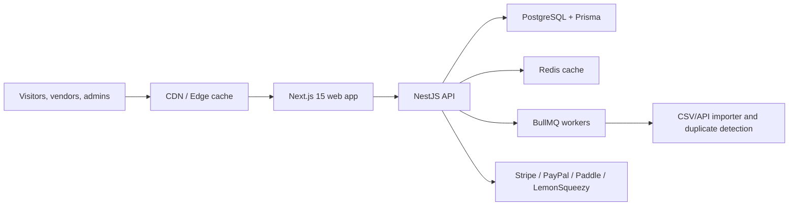

# Architecture

## High-Level Layout

The platform is a PNPM/Turbo monorepo with a public web application, modular API, shared packages, and infrastructure files.

## Domain Modules

- `auth`: JWT access and refresh tokens, sessions, devices, optional 2FA fields.
- `tools`: public directory listings, tags, categories, translations, sponsored and featured placement flags.
- `search`: cached hybrid search with facets and an AI-ready ranking hook.
- `reviews`: ratings and moderation-ready reviews.
- `bookmarks` and `collections`: user discovery workflows.
- `analytics`: impressions, clicks, CTR, MRR, ARR, conversion tracking, geo-ready event model.
- `billing`: provider adapters and plan-based monetization.
- `importer`: BullMQ import jobs, CSV/API metadata, duplicate candidates.
- `moderation`: reviews, ownership claims, pending edits, and reported content workflows.
- `cms`: landing page builder and localized CMS pages.
- `developer`: API keys, scopes, rate limits, public developer endpoint.
- `audit`: admin activity and webhook audit trail.

## Scaling Path

- Keep Prisma for transactional workflows and add OpenSearch/Meilisearch for high-volume public search.
- Partition `AnalyticsEvent` by month once traffic grows.
- Cache category pages, tool pages, and search facets through Redis and CDN cache tags.
- Run importer and analytics workers separately from the API container.
- Add queue priorities for sponsored listing imports and moderation-critical workflows.

